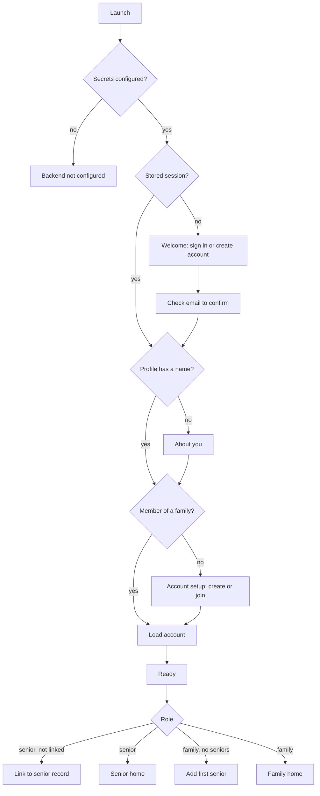

# Architecture

CareCompanion is a SwiftUI app backed directly by Supabase. It is split into a vendor free domain package and a thin app target that owns the UI and every third party SDK.

## Layers

| Layer | Location | Responsibility |
| --- | --- | --- |
| UI | `App/Features/`, `App/DesignSystem.swift` | SwiftUI screens and shared components. No networking. |
| Session | `App/Services/SessionController.swift` | Restores the auth session, loads the profile and care account, and builds `AppState` |
| Services | `App/Services/` | `SupabaseAuthSessionService`, `SupabaseCareRepository`, `HealthKitHealthDataProvider`, `SupabaseConfig` |
| Domain | `Sources/CareCore/` | `AppState`, models, `CareRepository` protocol, `SeniorCareSummary`, health aggregation, rule based insight, retry policy |
| Database | `Supabase/migrations/` | Tables, Row Level Security, RPCs, realtime publication |

`CareCore` has no dependencies, so `swift test` runs offline in under a second. Anything that talks to Supabase or HealthKit lives in the app target behind a protocol defined in `CareCore`.

## Launch and session flow

`RootView` in `App/CareCompanionApp.swift` switches on `SessionController.phase`:

Password reset links open the app through the `carecompanion://login-callback` URL scheme and route to "Choose a new password".

## State

- `AppState` is a main actor `@Observable` class. It holds the current `CareSnapshot` (account, members, seniors, check-ins, moods, medications, events, health, appointments, alerts, contacts, messages), the selected senior and the selected tab for each role.
- `SeniorCareSummary` derives everything a screen needs for one senior: today's check-in in the senior's time zone, medicines taken, attention items, averages and adherence. It is pure and unit tested.
- Views read `AppState` from the environment and call its async methods (`checkIn`, `recordMood`, `toggleMedication`, `triggerSOS`, `acknowledgeEmergency`, `addSenior`, `claimSenior`, `sendMessage` and so on). Each method writes through the repository and then refreshes the snapshot.

## Data flow

1. A view calls an `AppState` method.
2. `AppState` writes through `CareRepository`. New rows use an id generated on the device and are inserted with ignore duplicates, so a retry after a dropped connection cannot create a second row.
3. Postgres applies Row Level Security for the signed in user.
4. Realtime broadcasts the change to every member of the same account.
5. `SupabaseCareRepository` receives the event and asks `AppState` to refresh, and every open screen updates.

## Family navigation

`FamilyRootView` wraps the tab content in a `NavigationStack` with the navigation bar hidden at the root. Tapping a senior tile selects that senior and pushes `FamilyCareDetailView`. The status card opens Alerts when there is something to respond to, and otherwise opens the same detail screen. The bottom bar switches tabs by setting `AppState.familyTab`.

## Key decisions

- **The database is the security boundary.** The app ships only the publishable key. Every care table stores `account_id`, so each policy is a single indexed membership check.
- **Today means the senior's day.** Check-ins and medicine status are evaluated in the senior's time zone, not the caregiver's.
- **Medicine status is derived.** "Taken today" is the latest `medication_events` row on the senior's local day, not a stored flag.
- **Health stays with the senior.** Only the senior's own linked iPhone reads HealthKit, and it writes daily totals for that senior only.
- **Roles come from membership.** `account_members.role` decides the experience. Linking a login to a senior record is allowed only for the senior, enforced by a trigger.
- **Insight is rule based.** `MockAIService` builds the care insight and visit preparation from real account data with fixed, non medical wording. The `AIService` protocol leaves room for a server generated version later.
- **Premium features are free for now.** `SubscriptionAccess` and `AccessPolicy` remain in `CareCore` for a future subscription.
- **Debug builds build the active architecture only.** `ONLY_ACTIVE_ARCH = YES` for Debug keeps Simulator builds consistent between Xcode and the command line.
