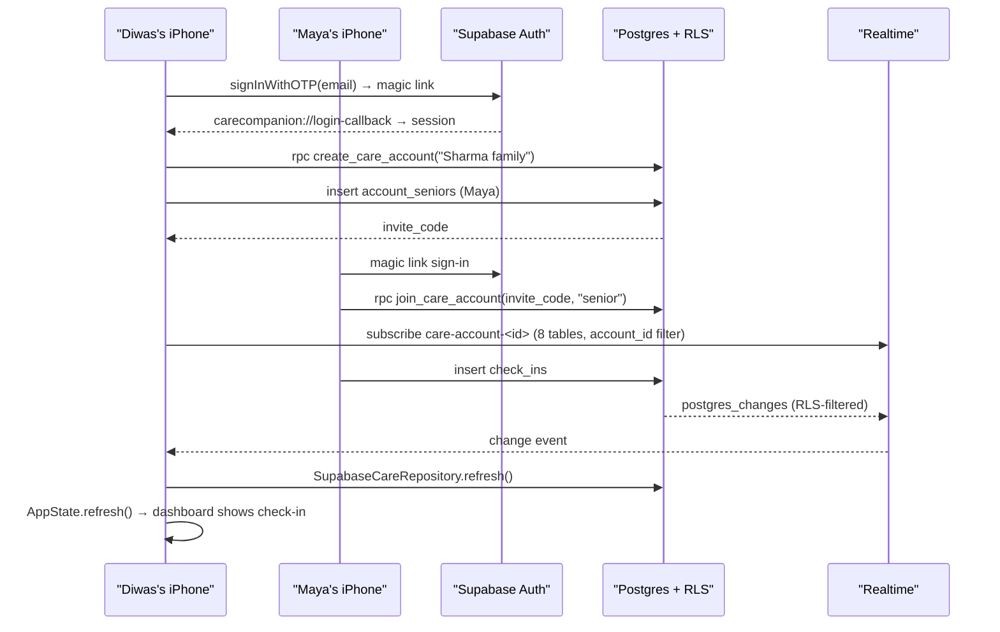

# CareCompanion database

Production persistence runs on Supabase (Postgres + Auth + Realtime). The iOS app talks to it only through the Supabase Swift SDK with the **publishable (anon) key**. Row Level Security is the security boundary: the key is public by design, and the database decides which rows a signed-in user may see.

There is no custom server. Demo mode never touches any of this.

## Where things live

| Path | Purpose |
| --- | --- |
| `Supabase/migrations/20260914000001_care_schema.sql` | Tables, constraints, `updated_at` triggers, indexes |
| `Supabase/migrations/20260914000002_rls_and_account_flow.sql` | RLS helpers and policies, profile trigger, account RPCs, realtime publication |
| `Supabase/tests/run_local.sh` | Applies both migrations to a throwaway local Postgres and runs `rls_test.sql` |
| `Config/Secrets.xcconfig` (git-ignored) | `SUPABASE_HOST`, `SUPABASE_ANON_KEY`; template in `Secrets.xcconfig.example` |
| `App/Services/SupabaseConfig.swift` | Builds the shared `SupabaseClient`, or `nil` when secrets are absent |
| `App/Services/SupabaseAuthSessionService.swift` | Magic-link sign-in (`carecompanion://login-callback`) |
| `App/Services/SupabaseCareRepository.swift` | `CareRepository` over PostgREST + realtime refresh |
| `Sources/CareCore/CareRecords.swift` | Vendor-free row types and row → `CareSnapshot` mapping (unit tested) |

## Schema

Every care table carries `account_id` (denormalized) so each RLS check is a single indexed membership lookup, and realtime can filter by account.

| Table | Purpose | Notes |
| --- | --- | --- |
| `profiles` | One row per `auth.users` user | Created by `on_auth_user_created` trigger |
| `care_accounts` | Family (future: organization) container | `invite_code` lets a second member join |
| `account_members` | Profile ↔ account, role `senior`/`family` | Unique per (account, profile) |
| `account_seniors` | Monitored senior | Optional `profile_id` if the senior signs in; soft delete |
| `check_ins` | "I'm okay" confirmations | |
| `mood_entries` | `Great` / `Okay` / `Low` + optional note | Optional link to a check-in |
| `medications` | Schedule | Soft delete |
| `medication_events` | `taken` / `skipped` / `missed` | App shows the latest event on the senior's local day |
| `health_snapshots` | Daily metrics | `source` ∈ `demo`, `manual`, `healthkit`, `device_import`; unique (senior, date, source) |
| `appointments` | Visits | Soft delete; hard delete also allowed |
| `alerts` | SOS and care alerts | Partial unique index: one open SOS per senior |
| `care_insights` | Saved AI insight | Data window + model metadata columns for Phase 6 |
| `appointment_ai_preps` | Saved appointment prep | |
| `subscription_statuses` | Cached entitlements | Client read-only; written server-side (Phase 3) |
| `audit_events` | Privacy/security actions | Append-only for members |

### "Today" is the senior's day

`CareRecords.snapshot(now:)` evaluates check-ins and medication status in each senior's `time_zone_identifier`. When Diwas opens the app in Austin, he sees Maya's Kathmandu day, not his own.

## Row Level Security

Rule: **a signed-in user can read and write only rows whose `account_id` is an account they belong to.** The `anon` role has no table privileges at all.

| Helper (SECURITY DEFINER) | Why |
| --- | --- |
| `is_account_member(account_id)` | Membership check without recursive policies on `account_members` |
| `senior_in_account(senior_id, account_id)` | Stops a member of account A from attaching account B's senior to A |
| `shares_account_with(profile_id)` | Lets co-members see each other's display names |

| Table | select | insert | update | delete |
| --- | --- | --- | --- | --- |
| `profiles` | self or co-member | trigger only | self | — |
| `care_accounts` | members | `create_care_account()` only | members | — |
| `account_members` | members | `create_care_account()` / `join_care_account()` only | — | self (leave) |
| `account_seniors` | members | members | members | — (soft delete) |
| senior-scoped care tables | members | members + senior in account | members + senior in account | `appointments` only |
| `subscription_statuses` | members or purchaser | server only | server only | — |
| `audit_events` | members | members, as self | — | — |

`Supabase/tests/rls_test.sql` checks two families. It asserts that the outsider cannot read, insert, attach a foreign senior, or acknowledge alerts across accounts, that anon is locked out, that a second open SOS is rejected, and that bogus invite codes fail. To confirm the test is not vacuous, weakening a read policy to `using (true)` makes it fail.

```sh
Supabase/tests/run_local.sh   # needs Homebrew postgresql; touches nothing remote
```

## Account information flow



Realtime-published tables: `check_ins`, `mood_entries`, `medications`, `medication_events`, `health_snapshots`, `appointments`, `alerts`, `appointment_ai_preps`. Postgres changes respect RLS, so a subscriber only receives rows from their own account.

## Indexes

- Membership (hit by every policy): `account_members (profile_id, account_id)`, plus the unique `(account_id, profile_id)`.
- Senior dashboard, latest first: `check_ins`, `mood_entries` and `medication_events` on `(… , occurred_at desc)`; open alerts; upcoming appointments.
- Latest health snapshot: `health_snapshots (senior_id, snapshot_date desc)`.
- Account feeds for realtime refresh: `check_ins`, `medication_events`, `alerts` and `audit_events` by `(account_id, time desc)`.

## Setup checklist (live project)

1. Apply migrations in order. Either paste each file into Supabase Dashboard → SQL Editor and run it, or use `psql "<connection string>" -v ON_ERROR_STOP=1 -f Supabase/migrations/<file>.sql`.
2. Dashboard → Authentication → URL Configuration → add `carecompanion://login-callback` to Redirect URLs.
3. Dashboard → Authentication → Providers → Email: keep enabled (magic link).
4. Copy `Config/Secrets.xcconfig.example` to `Config/Secrets.xcconfig` with the project host and publishable key. Never put the `service_role` key in the app.

## Not in this phase

- No UI switches the app into production mode yet. The app still boots `DemoCareRepository`. Sign-in, account creation and invite screens belong to Phase 5.
- `subscription_statuses` is written by a RevenueCat webhook in Phase 3.
- Live AI writes to `care_insights` / `appointment_ai_preps` arrive in Phase 6.
