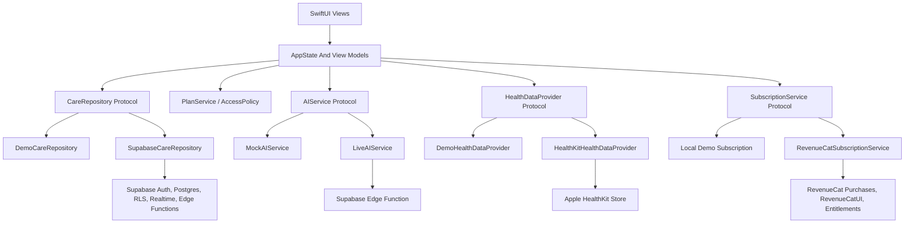
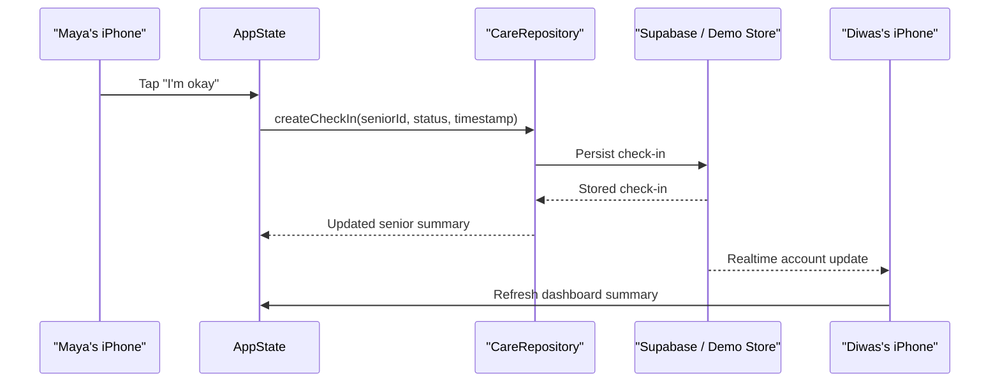
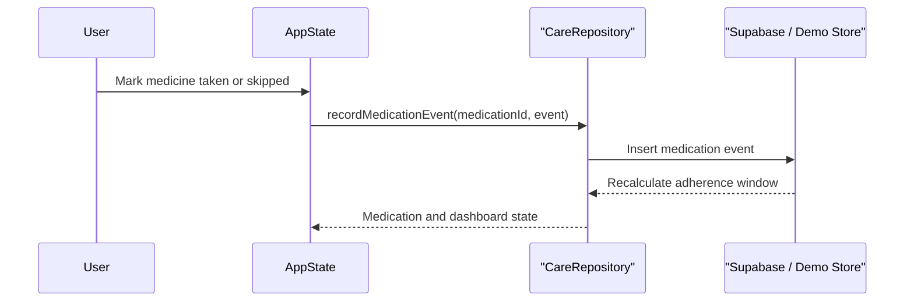
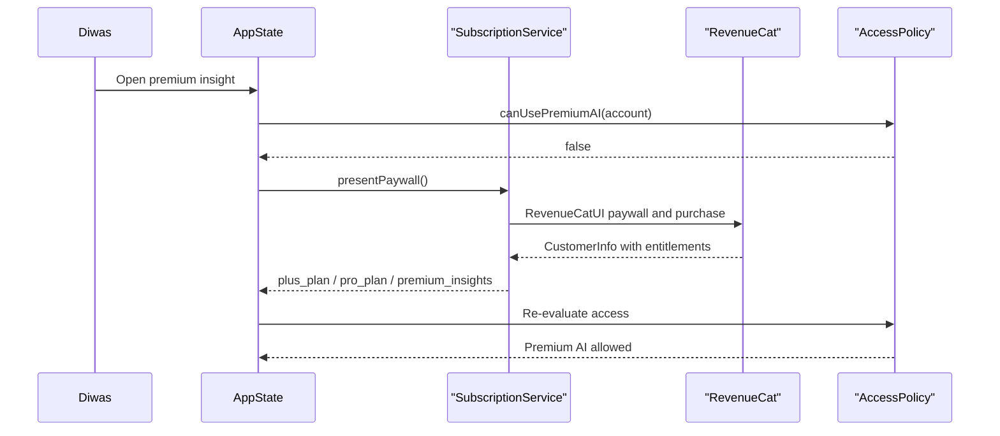
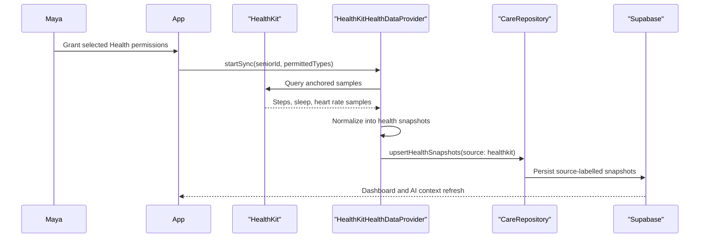
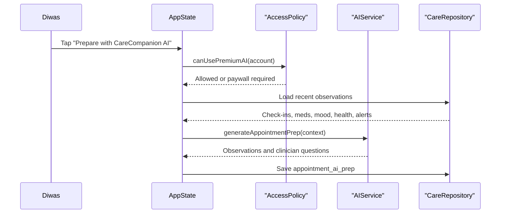

# CareCompanion Full Development Plan

> **For agentic workers:** REQUIRED SUB-SKILL: Use superpowers:subagent-driven-development (recommended) or superpowers:executing-plans to implement this plan task-by-task. Steps use checkbox (`- [ ]`) syntax for tracking.

**Goal:** Build CareCompanion from the current polished demo into a complete production-ready native iOS app with real persistence, information flow, sponsor subscriptions, Apple Health sync, QA gates and launch readiness.

**Architecture:** SwiftUI screens consume observable application state and service protocols, never vendor SDKs directly. Demo mode remains deterministic and offline while production mode uses Supabase for account-scoped care data, RevenueCat for entitlements and paywalls, HealthKit for user-approved health data and a safe AI service for care organization.

**Tech Stack:** Swift, SwiftUI, iOS 17+, NavigationStack, async/await, XCTest, Swift Charts where useful, RevenueCat Purchases, RevenueCatUI, Supabase Swift and HealthKit.

**Spec:** `AGENTS.md`, `docs/IMPLEMENTATION.md`, `docs/STATUS.md`, `docs/LOVABLE_REFERENCE.md`

## Global Constraints

- Native iOS only: no React, React Native, Node backend, Python backend, Android or custom REST server.
- Demo mode must work without Supabase, AI network requests, backend availability or HealthKit access.
- Views must not call Supabase, RevenueCat, HealthKit or AI APIs directly.
- Core safety features remain free: check-in, SOS, medications, mood, basic dashboard, manual appointments and basic health metrics.
- Premium features are gated by `plus_plan`, `pro_plan` or `premium_insights` entitlements.
- AI must not diagnose, prescribe, estimate disease probability or claim medical emergencies from health data.
- Seeded demo data must never be presented as HealthKit data.
- Organization-scale monitoring is future architecture only; do not build organization UI until family product quality is complete.
- Every meaningful phase ends with build, tests, status update and a stable checkpoint commit.

---

## Product Outcome

CareCompanion should support one coherent production story:

Maya Sharma lives in Kathmandu. Diwas lives in Austin. Maya uses a low-friction senior experience for daily wellbeing, medications, mood, appointments and SOS. Diwas sees a family dashboard with current status, recent care context, health trends and safe AI organization. Families can subscribe through RevenueCat. With permission, Apple Health data syncs into account-scoped health snapshots and powers richer, non-diagnostic context.

The hackathon demo remains available as a deterministic path, but the production app adds accounts, persistence, sync, entitlement management, onboarding, settings, observability and privacy controls.

## Target Architecture

## Core Data Model

Production persistence should model the family network first, then care events. Use stable UUID primary keys, `created_at`, `updated_at`, soft-delete where user recovery matters and account-scoped Row Level Security on every care table.

| Entity | Purpose | Key relationships |
| --- | --- | --- |
| `profiles` | App user identity and basic display data | Supabase auth user id |
| `care_accounts` | Family or future organization container | Owns members and seniors |
| `account_members` | User membership, role and permissions | Joins profiles to care accounts |
| `account_seniors` | Monitored senior profile | Belongs to care account |
| `check_ins` | Daily wellbeing confirmation | Senior, created by senior or caregiver |
| `mood_entries` | Mood state and optional note | Senior, may be linked to check-in |
| `medications` | Medication schedule | Senior |
| `medication_events` | Taken, skipped or missed record | Medication, senior |
| `health_snapshots` | Daily or sampled health metrics | Senior, source-labelled |
| `appointments` | Visit schedule and preparation state | Senior |
| `alerts` | SOS and care alerts | Senior, account, acknowledgement state |
| `care_insights` | AI-generated safe summaries | Senior, triggering data window |
| `appointment_ai_preps` | AI-generated visit prep | Appointment, senior |
| `subscription_statuses` | Cached entitlement state for app decisions | Care account or purchaser profile |
| `audit_events` | Privacy/security-relevant actions | Account, actor profile |

Health snapshot fields should include `source` values such as `demo`, `manual`, `healthkit`, and `device_import`. This prevents seeded values from being mistaken for Apple Health data.

## Information Flow

### Check-In

### Medication Event

### RevenueCat Sponsor / Premium Unlock

### Apple Health Sync

### Appointment Prep

## Phase 0: Stabilize Current Demo

**Goal:** Keep the current clickable demo reliable while production infrastructure is added behind protocols.

**Deliverables**

- [ ] Confirm the current senior-to-family flow runs from cold launch through onboarding, check-in, mood, family dashboard, premium insight, appointment prep, SOS and reset.
- [ ] Add or update UI tests for the deterministic demo path once the app target has a UI test bundle.
- [ ] Keep `DemoCareRepository`, `MockAIService`, local subscription fallback and hidden demo reset working offline.
- [ ] Make visible copy clear when data is seeded demo data.
- [ ] Update `docs/STATUS.md` with exact build, test and simulator verification commands.
- [ ] Commit stable checkpoint: `chore: stabilize demo baseline`.

**Exit Criteria**

- [ ] `swift test` passes.
- [ ] iOS simulator build passes.
- [ ] Full 90-second demo succeeds three consecutive times.
- [ ] No critical demo action is visual-only.

## Phase 1: Production Architecture Hardening

**Goal:** Prepare the codebase for real services without letting views know about vendor SDKs.

**Files**

- Modify: `Sources/CareCore/AppState.swift`
- Modify: `Sources/CareCore/DemoCareRepository.swift`
- Modify: `Sources/CareCore/AIService.swift`
- Modify: `Sources/CareCore/AppNavigation.swift`
- Create: `Sources/CareCore/HealthDataProvider.swift`
- Create: `Sources/CareCore/SubscriptionService.swift`
- Create: `Sources/CareCore/PlanService.swift`
- Create: `Sources/CareCore/SyncStatus.swift`
- Test: `Tests/CareCoreTests/*`

**Steps**

- [ ] Define explicit protocol methods for check-ins, mood entries, medication events, health snapshots, appointments, alerts, insight storage and account membership.
- [ ] Add typed service errors: offline, unauthorized, premiumRequired, healthPermissionDenied, vendorUnavailable and invalidState.
- [ ] Add view-model or state actions for every user intent currently handled directly inside SwiftUI.
- [ ] Keep demo implementations deterministic and synchronous where possible, with async method signatures matching production services.
- [ ] Test each service boundary with demo implementations and failure cases.
- [ ] Commit stable checkpoint: `refactor: harden care service boundaries`.

**Exit Criteria**

- [ ] Views depend on AppState/view models and protocols, not Supabase, RevenueCat, HealthKit or AI vendors.
- [ ] Demo mode behavior is unchanged.
- [ ] Tests cover premium denial, offline fallback and reset.

## Phase 2: Database And Account Information Flow

**Goal:** Add Supabase persistence, auth, Row Level Security and realtime account-scoped information flow.

**Files**

- Create: `Supabase/migrations/*.sql`
- Create: `Sources/CareCore/SupabaseCareRepository.swift`
- Create: `Sources/CareCore/AuthSessionService.swift`
- Create: `docs/DATABASE.md`
- Modify: `docs/STATUS.md`
- Test: repository and policy tests where local doubles can cover behavior

**Steps**

- [ ] Create schema for `profiles`, `care_accounts`, `account_members`, `account_seniors`, `check_ins`, `mood_entries`, `medications`, `medication_events`, `health_snapshots`, `appointments`, `alerts`, `care_insights`, `appointment_ai_preps`, `subscription_statuses` and `audit_events`.
- [ ] Add RLS policies that require membership in the owning `care_account_id`.
- [ ] Add indexes for account feed loading, senior dashboard loading, realtime updates and latest health snapshot queries.
- [ ] Implement `SupabaseCareRepository` behind `CareRepository`.
- [ ] Add auth bootstrap for email or magic-link sign-in, plus demo-mode bypass.
- [ ] Add realtime subscriptions for check-ins, medication events, alerts and appointment prep updates.
- [ ] Document schema, RLS policy intent and account data flow in `docs/DATABASE.md`.
- [ ] Commit stable checkpoint: `feat: add supabase care repository`.

**Exit Criteria**

- [ ] Maya and Diwas can share one account in production mode.
- [ ] Cross-account reads are denied by RLS.
- [ ] Realtime updates refresh the family dashboard without restarting the app.
- [ ] Demo mode still runs when Supabase is unreachable.

## Phase 3: Sponsor Integration With RevenueCat

**Goal:** Replace local premium fallback with real RevenueCat purchases, paywalls and entitlement-driven access.

**Interpretation:** In this plan, "sponsor integration" means the monetization and premium-access sponsor layer powered by RevenueCat. The app can later add sponsored accounts or grant flows, but the first production integration is RevenueCat entitlements and RevenueCatUI.

**Files**

- Modify: `Package.swift` or Xcode package references
- Create: `App/Services/RevenueCatSubscriptionService.swift`
- Create: `App/Services/RevenueCatConfiguration.swift`
- Create: `docs/REVENUECAT.md`
- Modify: `Sources/CareCore/SubscriptionService.swift`
- Modify: `Sources/CareCore/PlanService.swift`
- Test: entitlement mapping and access-policy tests

**Steps**

- [ ] Add RevenueCat Purchases and RevenueCatUI packages.
- [ ] Configure app startup with the public iOS RevenueCat SDK key from a non-committed configuration file.
- [ ] Configure offerings in RevenueCat dashboard for Plus and Pro.
- [ ] Map entitlements exactly: `plus_plan`, `pro_plan`, `premium_insights`.
- [ ] Present RevenueCatUI paywall for AI insight, appointment prep and premium health explanations.
- [ ] Refresh entitlements after purchase, restore purchase, app foreground and customer info changes.
- [ ] Keep SOS, check-ins, mood, medications, basic dashboard and manual appointments free.
- [ ] Cache last known entitlements locally for graceful app startup, then refresh from RevenueCat.
- [ ] Document dashboard setup, Test Store verification and entitlement mapping in `docs/REVENUECAT.md`.
- [ ] Commit stable checkpoint: `feat: integrate revenuecat subscriptions`.

**Exit Criteria**

- [ ] RevenueCat Test Store purchase unlocks premium AI in simulator.
- [ ] Restore purchase works.
- [ ] Purchase cancellation does not grant access.
- [ ] Plus allows up to 5 monitored seniors and Pro allows up to 25.
- [ ] Premium UI never blocks safety workflows.

## Phase 4: Apple Health Sync

**Goal:** Add user-approved Apple Health data sync for steps, sleep and resting heart rate while preserving privacy, source labels and demo clarity.

**Files**

- Create: `Sources/CareCore/HealthDataProvider.swift`
- Create: `App/Services/HealthKitHealthDataProvider.swift`
- Create: `App/Features/HealthPermissionsView.swift`
- Create: `docs/HEALTHKIT.md`
- Modify: `Sources/CareCore/DemoCareRepository.swift`
- Modify: `Sources/CareCore/AppState.swift`
- Test: provider normalization tests with sample fixtures

**Steps**

- [ ] Add HealthKit capability to the app target.
- [ ] Request read permissions only for required types: step count, sleep analysis and resting heart rate.
- [ ] Explain permissions in clear user copy before showing the system prompt.
- [ ] Implement anchored queries for incremental sync.
- [ ] Normalize raw HealthKit samples into `health_snapshots` with `source = healthkit`.
- [ ] Store permission state and latest sync status without storing unnecessary raw samples.
- [ ] Handle denied, revoked and partial permissions gracefully.
- [ ] Prevent HealthKit sync in demo mode unless explicitly using a development toggle.
- [ ] Document permission types, privacy behavior, revocation behavior and test steps in `docs/HEALTHKIT.md`.
- [ ] Commit stable checkpoint: `feat: sync apple health metrics`.

**Exit Criteria**

- [ ] User can grant and revoke permissions without breaking the app.
- [ ] Health dashboard distinguishes demo, manual and HealthKit-sourced values.
- [ ] Sync failures show recoverable UI, not broken dashboards.
- [ ] AI context uses health trends as observations only and never diagnoses.

## Phase 5: Complete Production App Features

**Goal:** Fill in the real family-care workflows needed for a complete functional app.

**Feature Areas**

- [ ] Account onboarding: create family account, join by invite, select role, add senior.
- [ ] Senior profile management: name, timezone, location, emergency contacts and care preferences.
- [ ] Medication management: create schedule, mark taken/skipped, show adherence history.
- [ ] Mood journal: daily mood, optional note and family-visible summary.
- [ ] Appointments: create, edit, complete and archive visits.
- [ ] Alerts: SOS, missed check-in, medication concern and acknowledged/resolved states.
- [ ] Family dashboard: current status, trend summaries, alerts, appointments and senior switching.
- [ ] Settings: privacy, Health permissions, subscription management, reset demo and sign out.
- [ ] Accessibility: VoiceOver labels, Dynamic Type, Reduce Motion, hit targets and contrast.
- [ ] Localization-ready strings for production copy.

**Exit Criteria**

- [ ] A new family account can be created and used without demo data.
- [ ] A caregiver can invite or join the same care account.
- [ ] Every primary workflow has loading, success, empty and error states.
- [ ] Demo mode remains one tap away for judging and sales demos.

## Phase 6: Safe AI And Information Governance

**Goal:** Make AI useful for organization and appointment preparation without creating medical-risk behavior.

**Files**

- Create: `Supabase/functions/care-ai/index.ts` if Supabase Edge Functions are selected
- Modify: `Sources/CareCore/AIService.swift`
- Create: `docs/AI_SAFETY.md`
- Test: prompt/output safety tests with deterministic fixtures

**Steps**

- [ ] Move live AI calls server-side so provider secrets never ship in the app.
- [ ] Send only the minimum account-scoped context needed for the requested insight.
- [ ] Require structured output for observations, suggested check-ins and clinician questions.
- [ ] Reject or rewrite output that includes diagnosis, prescriptions, disease probability or emergency claims.
- [ ] Store generated AI outputs with input data window, model metadata, created time and account id.
- [ ] Keep `MockAIService` as the offline fallback and UI test provider.
- [ ] Document allowed language, prohibited language and failure behavior in `docs/AI_SAFETY.md`.

**Exit Criteria**

- [ ] Premium AI works in production mode.
- [ ] Network or AI failures fall back to safe deterministic behavior where appropriate.
- [ ] Tests reject unsafe medical claims.

## Phase 7: QA, Observability And Launch Readiness

**Goal:** Make the app reliable enough for external testers and eventual App Store submission.

**Steps**

- [ ] Add unit tests for repositories, access policy, HealthKit normalization, AI safety and scenario reset.
- [ ] Add UI tests for onboarding, senior check-in, mood, family dashboard, premium paywall, appointment prep, SOS and reset.
- [ ] Add lightweight analytics events for onboarding completion, check-in, mood entry, medication event, SOS, paywall opened, purchase success, purchase cancel and Health permission state.
- [ ] Add crash reporting if selected for launch.
- [ ] Add privacy review: what data is collected, why, where it is stored and how to delete it.
- [ ] Add App Store privacy labels draft.
- [ ] Add internal beta checklist and TestFlight build steps.
- [ ] Run three complete production-mode demo passes and three offline demo-mode passes.
- [ ] Commit stable checkpoint: `chore: prepare launch qa`.

**Exit Criteria**

- [ ] Clean simulator build passes.
- [ ] Unit tests and UI tests pass.
- [ ] No known critical or high-severity privacy, entitlement, sync or demo-path bugs.
- [ ] `docs/STATUS.md` contains exact verification evidence and remaining launch risks.

## Implementation Order

1. Phase 0: freeze and verify the current clickable demo.
2. Phase 1: harden service boundaries before adding vendors.
3. Phase 3: integrate RevenueCat first because premium AI and sponsor access depend on entitlements.
4. Phase 2: add Supabase persistence and realtime family information flow.
5. Phase 4: add Apple Health sync once database source labels and privacy docs are ready.
6. Phase 6: add live AI behind premium and safe output checks.
7. Phase 5: complete production family-care workflows in slices.
8. Phase 7: launch QA, observability, privacy and TestFlight readiness.

RevenueCat can land before Supabase because customer entitlements can be read on-device. Supabase should land before HealthKit because HealthKit data needs account-scoped source-labelled persistence.

## Risks And Controls

| Risk | Control |
| --- | --- |
| Health data is over-interpreted | AI safety tests, source labels, non-diagnostic copy |
| Premium gates safety features | AccessPolicy tests require safety workflows to stay free |
| Demo mode breaks during production work | Phase 0 regression tests and demo repository contract tests |
| Supabase RLS leaks family data | RLS tests and account-scoped policies on every table |
| RevenueCat dashboard mismatch | `docs/REVENUECAT.md` setup checklist and entitlement mapping tests |
| Apple Health permission denial breaks UI | Explicit denied/revoked/partial states |
| Too many features dilute polish | Phase gates require verification before new feature work |

## Definition Of Full Development Ready

- [ ] Demo mode works offline and is repeatable.
- [ ] Production mode supports real accounts, account members and shared senior data.
- [ ] Supabase persistence, RLS and realtime updates are working.
- [ ] RevenueCatUI paywall and Test Store purchase unlock premium features.
- [ ] Apple Health sync imports permitted steps, sleep and resting heart rate with clear source labels.
- [ ] AI insight and appointment prep are premium, safe, structured and non-diagnostic.
- [ ] All core workflows have loading, empty, error and success states.
- [ ] Unit tests, UI tests and simulator build pass.
- [ ] Privacy, RevenueCat, HealthKit, database and AI safety docs are current.
- [ ] Three consecutive demo runs pass in both demo mode and production-mode staging.
